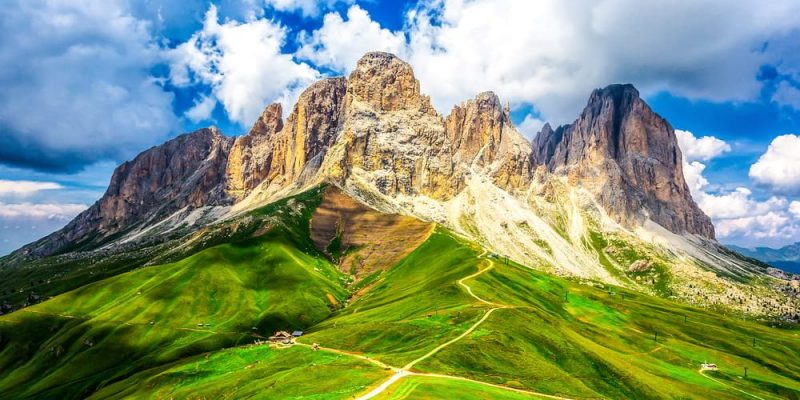

# Galeria Responsive Con Flexbox

Este proyecto es una practica sencilla de HTML y CSS usando Flexbox. El objetivo es crear una galeria de imagenes que se adapte a diferentes tamanos de pantalla, desde moviles hasta ordenadores.

## Descripcion

La pagina muestra varias imagenes dentro de una galeria. Las imagenes se organizan de forma flexible: cuando hay espacio suficiente, aparecen varias en la misma fila; cuando la pantalla es mas pequena, bajan automaticamente a la siguiente linea.

Este comportamiento se consigue usando Flexbox en CSS.

## Tecnologias Utilizadas

- HTML5
- CSS3
- Flexbox
- Diseno responsive

## Estructura Basica Del HTML

El HTML contiene un elemento `main` con la clase `galeria`. Dentro de ese `main` hay varios `div`. Cada `div` funciona como una tarjeta y contiene una imagen y un texto.

```html
<main class="galeria">
  <div>
    
    <p>Montana Utah</p>
  </div>

  <div>
    
    <p>Sierra Nevada</p>
  </div>

  <div>
    
    <p>Montana</p>
  </div>

  <div>
    
    <p>Montana Mexico</p>
  </div>
</main>
```

La clase `galeria` se utiliza en CSS para aplicar Flexbox al contenedor principal.

## Codigo CSS Principal

```css
.galeria {
  width: min(1100px, 94%);
  margin: 40px auto;
  display: flex;
  flex-wrap: wrap;
  gap: 20px;
}
```

## Explicacion Del Contenedor

```css
display: flex;
```

Activa Flexbox. Esto hace que los `div` que estan dentro de la galeria se coloquen uno al lado del otro.

```css
flex-wrap: wrap;
```

Permite que las tarjetas bajen a otra fila cuando no caben en la misma linea.

```css
gap: 20px;
```

Agrega espacio entre las imagenes.

```css
width: min(1100px, 94%);
```

Hace que la galeria tenga un ancho maximo de `1100px`, pero en pantallas pequenas ocupe solo el `94%` del ancho disponible.

```css
margin: 40px auto;
```

Agrega espacio arriba y abajo, y centra la galeria horizontalmente.

## Estilos Para Las Tarjetas

```css
.galeria div {
  flex: 1 1 250px;
}
```

Este selector significa: aplicar estilos a todos los `div` que esten dentro de un elemento con la clase `galeria`.

## Explicacion De Las Tarjetas

```css
flex: 1 1 250px;
```

Indica que cada tarjeta puede crecer, puede encogerse y tiene un tamano base de `250px`.

## Estilos Para Las Imagenes

```css
.galeria img {
  width: 100%;
  height: 220px;
  object-fit: cover;
  border: 1px solid #777;
  background: white;
}
```

Este selector significa: aplicar estilos a todas las imagenes que esten dentro de la galeria.

## Explicacion De Las Imagenes

```css
width: 100%;
```

Hace que la imagen ocupe todo el ancho disponible dentro de su tarjeta.

```css
height: 220px;
```

Hace que todas las imagenes tengan la misma altura.

```css
object-fit: cover;
```

Hace que la imagen llene su caja sin deformarse. Si la imagen es muy grande o tiene una proporcion diferente, puede recortarse un poco, pero no se estira.

```css
border: 1px solid #777;
```

Agrega un borde gris alrededor de cada imagen.

```css
background: white;
```

Agrega un fondo blanco a cada imagen.

## Imagenes Con La Misma Anchura

Si se quiere que todas las imagenes tengan exactamente la misma anchura, se puede usar este codigo:

```css
.galeria img {
  width: 250px;
  height: 220px;
  object-fit: cover;
  border: 1px solid #777;
}
```

Pero si se esta usando una tarjeta con `div`, lo mejor es controlar la anchura desde el `div`:

```css
.galeria div {
  flex: 0 0 250px;
}
```

Y luego hacer que la imagen ocupe todo el ancho de esa tarjeta:

```css
.galeria img {
  width: 100%;
  height: 220px;
  object-fit: cover;
}
```

Esto significa que la tarjeta no crece, no se encoge y mantiene una anchura base de `250px`.

## Adaptacion A Moviles

Para que en moviles cada imagen ocupe todo el ancho disponible, se puede usar una media query:

```css
@media (max-width: 600px) {
  .galeria div {
    flex: 0 0 100%;
  }
}
```

Esto significa que cuando la pantalla mida `600px` o menos, cada tarjeta ocupara una fila completa.

## Objetivo Del Proyecto

El objetivo de este proyecto es aprender que:

- HTML se usa para crear el contenido.
- CSS se usa para dar estilo al contenido.
- Flexbox sirve para acomodar elementos de forma flexible.
- `object-fit: cover` ayuda a que las imagenes no se deformen.
- Las media queries permiten adaptar el diseno a pantallas pequenas.

## Como Ver El Proyecto

1. Descarga o clona el repositorio.
2. Abre el archivo `index.html` en el navegador.
3. Verifica que las imagenes esten en la carpeta correcta.

Este proyecto es una practica basica para entender como crear una galeria responsive usando Flexbox.